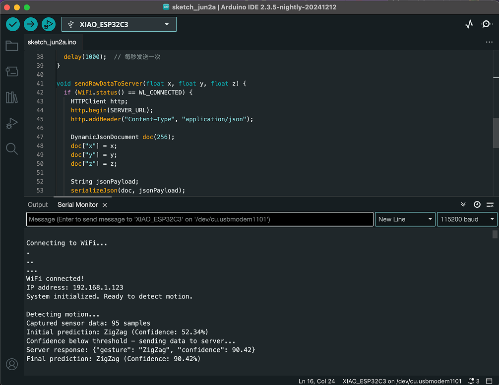
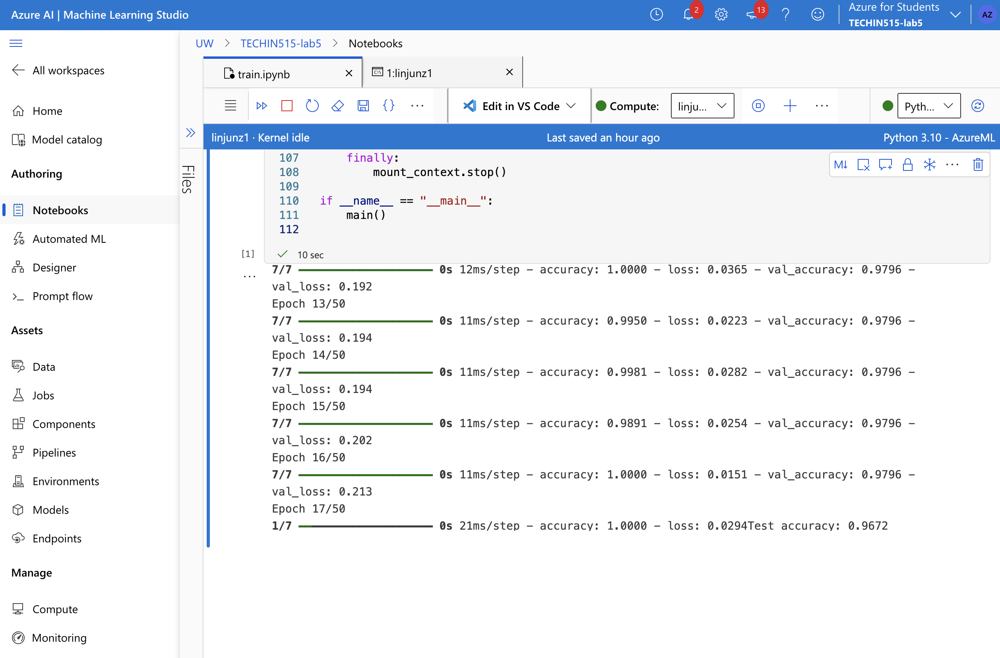
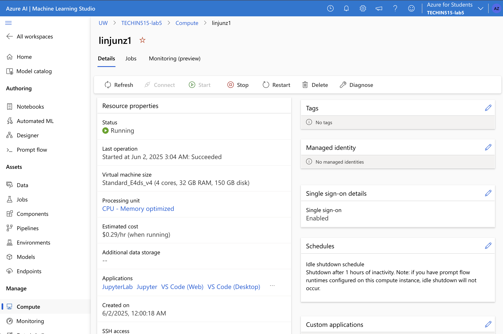
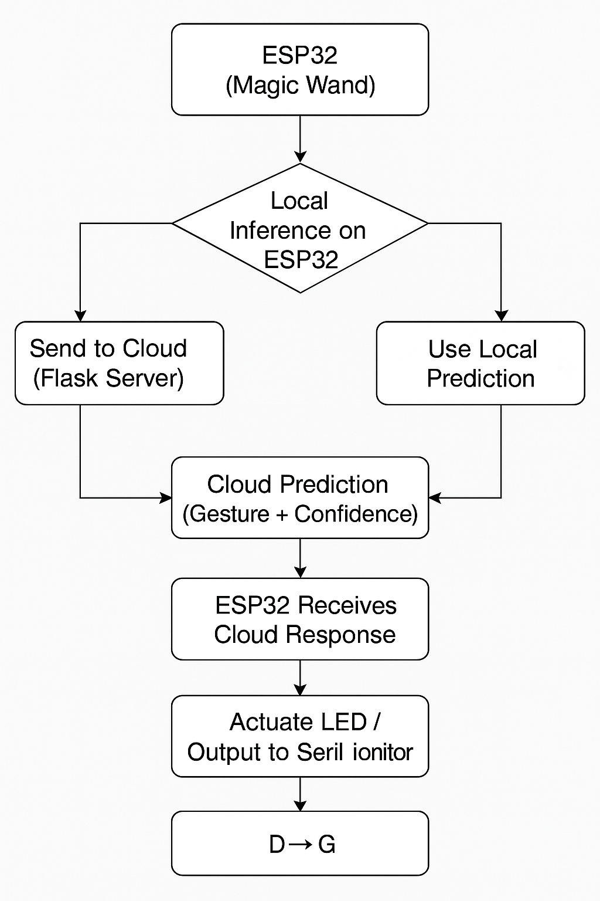

# TECHIN515 Lab 5 - Edge-Cloud Offloading

This project builds upon lab 4. We will implement an edge-cloud offloading strategy, which performs inference or computation locally on ESP32, and offloads it to the cloud (Microsoft Azure) under certain conditions.

The outline of this lab is as follows:
- Train and host a model in Azure
- Deploy the model endpoint as a web app
- Configure magic wand to offload to cloud when uncertain

## Learning Objectives

By completing this lab, students will:
- Be capable of training and hosting models in Azure
- Deploy model as a web app
- Understand cloud-edge offloading

## Screenshots

1️⃣ ESP32 Serial Monitor Output

2️⃣ Model Training in Azure Notebook

3️⃣ Compute Instance Configuration in Azure

## Discussion
 1.  Is server's confidence always higher than wand's confidence from your observations? What is your hypothetical reason for the observation?
- No, the server’s confidence is not always higher than the wand’s confidence. However, in most cases, it tends to be higher. This is likely because the cloud model is trained on a larger, more diverse dataset, potentially aggregated from multiple users, and benefits from more computational resources and complex model architectures. In contrast, the ESP32 uses a lightweight model optimized for embedded systems, which may have reduced accuracy on less common or noisy gestures.

2. Sketch the data flow of this lab

3. Analyze pros and cons of edge-first, fallback-to-server when uncertain

| Aspect                 | Pros                                                                     | Cons                                                          |
| ---------------------- | ------------------------------------------------------------------------ | ------------------------------------------------------------- |
| Connectivity           | Works offline most of the time, reduced cloud dependency                 | Requires internet for cloud offloading when confidence is low |
| Latency                | Local inference is fast and low-latency                                  | Cloud inference introduces additional delay                   |
| Prediction Consistency | Edge reduces load on server, lower network usage                         | Results may vary between local and cloud models               |
| Data Privacy           | Only low-confidence data sent to cloud, preserving privacy for most data | Some sensitive sensor data still sent to cloud                |

4. Name a strategy to mitigate at least one limitation
- Mitigation Strategy:
Implement periodic retraining of the edge model using cloud-collected data. This helps improve the accuracy of the local model, reducing the need to offload to the cloud and ensuring that the ESP32 can handle more cases confidently.
Alternatively, use on-device caching: if the ESP32 cannot connect to the cloud during offloading, it can store the raw data locally and retry sending it later when the connection is restored.

